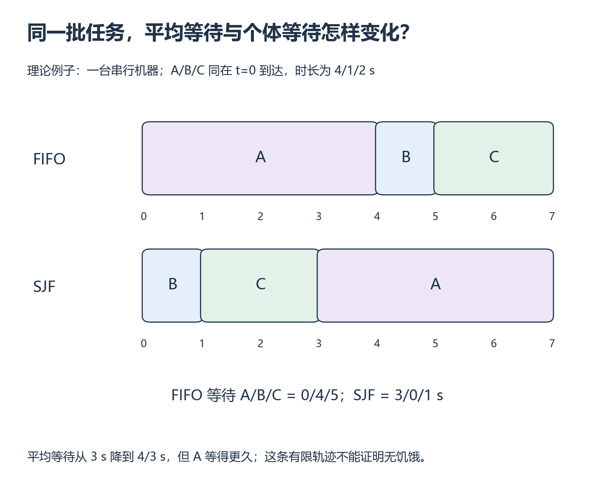

# W16 第 1 段：平均等待更低，是否每个任务都更舒服？

[本单元](README.md) · [课程目录](../../course/README.md)

调度改变工作的先后顺序，不一定减少总工作量。短任务优先可以改善平均等待，却让某个长任务等得更久；这一节同时保留整体指标和每个任务的经历。

## 视频与正文

主要阅读下列正文与图解。视频范围待核验；已看懂的重复内容只需回查。

## 开始前

先能从 W15 日志计算等待与执行时长；统计规则回 M4，Kubernetes 配置关系回 [S6](../../course/bridges/s06.md)。

资源定位：[排队指标、FIFO 与 SJF](../../resources/scheduling.md#r-ostep)。

**先读**：[OSTEP 第 7 章 PDF](../../resources/scheduling.md#r-ostep) §7.1 工作负载假设、§7.2 指标、§7.3 FIFO，再读 §7.4 SJF。关注假设被逐个放宽的过程。

**接着想一想**：把教材 CPU 作业替换成自己的逻辑槽位模型，明确它不含 GPU 内核并发、显存装箱或抢占。写出排队时间、周转时间和 makespan 的定义。

## 同一轨迹，才能公平比较两种顺序

**FIFO** 按到达顺序选择任务，**SJF** 在可选任务中优先选择较短任务。本实验使用非抢占策略：一旦开始，不因后来来了更短任务而中断。理想 SJF 已知真实时长；使用估计值则要把误差算进讨论。

下图先演示时长 4、1、2 秒且同时到达的三个任务。FIFO 让 A 先运行，SJF 先让 B、C 完成；两者总时长都是 7 秒，但等待分布不同。图中平均等待变好时，A 从不用等变为等 3 秒，这就是继续检查公平性的理由。

*沿时间轴找开始点，再按 A/B/C 身份对应两条轨迹 [放大查看 SVG](../../assets/figures/w16-scheduling-trace.svg)。暂停：为什么两条时间线都忙满了，平均等待却不相同？*

**换一组时长自己算**

单槽位、无抢占、切换开销忽略；A/B/C 同时在 0 到达，真实时长为 6/2/1，FIFO 并列按 ID 排序。

先遮住核对答案，画出 6/2/1 秒这一组输入的两条时间线。

**暂停题**：分别计算每个任务等待、周转，以及平均值和 makespan。

核对答案

FIFO 的 A/B/C 等待为 0/6/8，平均 14/3；周转为 6/8/9，平均 23/3。SJF 按 A/B/C 身份记等待为 3/1/0，平均 4/3；周转为 9/3/1，平均 13/3。两者 makespan 都为 9，忙碌比例均 100%。平均等待下降并不代表总工作量减少或 GPU 利用率提升；这里测的是逻辑槽位模型。

**动手练习**：给 3 个同时到达、时长不同的任务手排 FIFO/SJF，计算每个任务开始与结束时间。相同总工作量的单槽位、无空闲例子中，两者 makespan 可以一样，平均等待仍会不同。

**检查结果**：不用运行仿真也能核对一个小例子的全部指标。

## 完成后

把代码、预测与实际结果记在同一份笔记中。完成本段检查后，沿下方链接继续。

[上一课](README.md) · [下一课](session-02.md)
